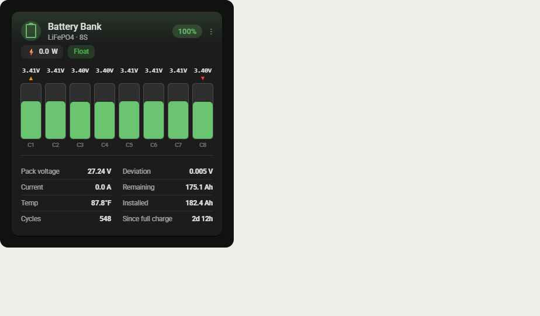
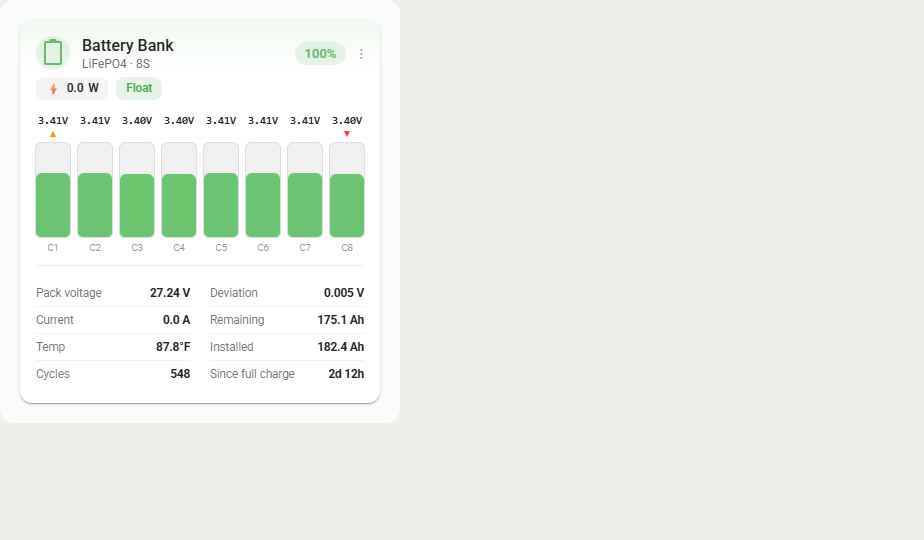
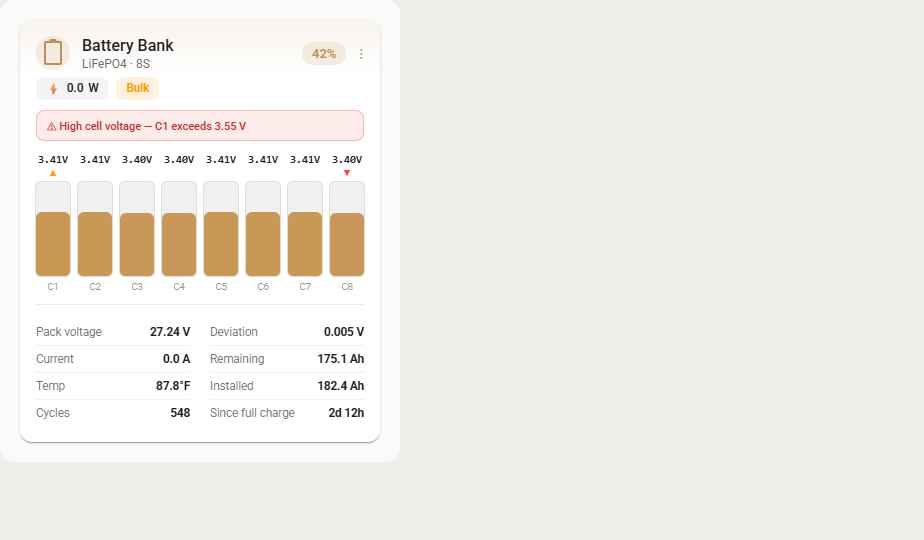
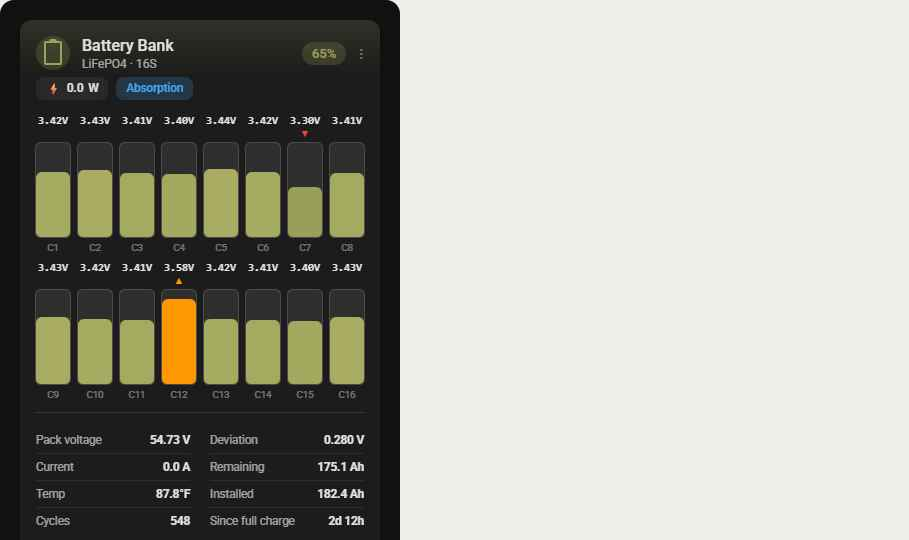

# HA BMS Card

A Home Assistant Lovelace card for monitoring a LiFePO4 battery pack: per-cell
voltages, min/max balancing badges, state of charge, power, charge mode,
capacity, temperature, cycle count, and configurable alarm banners.

Every value is a plain entity mapping in the card config, so it works with
**any BMS integration that exposes per-cell voltage sensors** (SerialBattery,
JK BMS, Victron, ESPHome, and others) — nothing is tied to one specific
battery or BMS.



<details>
<summary>More screenshots (light theme, alarm state, 16-cell two-row)</summary>





</details>

## Features

- Per-cell voltage bars scaled to the LiFePO4 2.90–3.65V operating band, with
  fixed danger colors below 3.00V / above 3.55V
- ▼ / ▲ badges on the pack's min/max cell (uses the BMS's own "min/max cell
  ID" entities when available, otherwise computed locally)
- Tap a cell to expand its detail panel (voltage, delta from pack average,
  rank)
- SOC-tinted cell coloring (configurable warm/cool gradient, or a flat color)
- Automatically follows Home Assistant's active light/dark theme
- Configurable alarm banner driven by whatever alarm/fault entities your BMS
  integration exposes
- Single-row or two-row layouts for 4S–16S+ packs
- Fully configured through the GUI editor — no YAML required, no entities
  hardcoded

## Installation

### HACS (recommended)

1. In HACS, go to **Frontend** → the **⋮** menu → **Custom repositories**.
2. Add this repository URL with category **Dashboard**.
3. Search for **HA BMS Card** in HACS and install it.
4. Add the resource if HACS didn't do so automatically (Settings →
   Dashboards → **⋮** → Resources).

### Manual

1. Download `ha-bms-card.js` from the
   [latest release](../../releases/latest).
2. Copy it to `<config>/www/ha-bms-card.js`.
3. Add it as a Lovelace resource: Settings → Dashboards → **⋮** →
   **Resources** → **Add Resource**:
   - URL: `/local/ha-bms-card.js`
   - Resource type: `JavaScript Module`

## Configuration

Add the card through the dashboard UI (**Add Card** → **HA BMS Card**)
and pick your entities in the editor, or configure it directly in YAML:

```yaml
type: custom:ha-bms-card
name: Battery Bank
cell_entities:
  - sensor.battery_cell_1_voltage
  - sensor.battery_cell_2_voltage
  - sensor.battery_cell_3_voltage
  - sensor.battery_cell_4_voltage
  - sensor.battery_cell_5_voltage
  - sensor.battery_cell_6_voltage
  - sensor.battery_cell_7_voltage
  - sensor.battery_cell_8_voltage
min_cell_id_entity: sensor.battery_minimum_voltage_cell_id
max_cell_id_entity: sensor.battery_maximum_voltage_cell_id
deviation_entity: sensor.battery_cell_voltage_deviation
soc_entity: sensor.battery_charge
power_entity: sensor.battery_power
current_entity: sensor.battery_dc_bus_current
pack_voltage_entity: sensor.battery_dc_bus_voltage
charge_mode_entity: sensor.battery_charge_mode
capacity_remaining_entity: sensor.battery_capacity
capacity_installed_entity: sensor.battery_installed_capacity
temperature_entity: sensor.battery_temperature
cycles_entity: sensor.battery_total_charge_cycles
since_full_charge_entity: sensor.battery_time_since_last_full_charge
alarm_entities:
  - sensor.battery_high_voltage
  - sensor.battery_low_voltage
  - sensor.battery_high_charge_current
  - binary_sensor.battery_allow_to_charge
  - binary_sensor.battery_allow_to_discharge
layout_mode: single-row
gradient_enabled: true
soc_warm_color: "#FF7043"
soc_cool_color: "#66BB6A"
flat_cell_color: "#66BB6A"
```

Only `cell_entities` and `soc_entity` are required — every other field is
optional and the card degrades gracefully (missing stats render as `--`,
pack voltage/power fall back to values derived from the cells/current when
not mapped directly).

### Entity reference

| Config key | Expected entity | Notes |
|---|---|---|
| `cell_entities` | one `sensor` per cell, in physical order | required |
| `soc_entity` | pack state of charge, % | required |
| `min_cell_id_entity` / `max_cell_id_entity` | cell number (1-based) of the min/max voltage cell | optional; falls back to local min/max |
| `deviation_entity` | max − min cell voltage, V | optional; computed locally otherwise |
| `power_entity` | pack power, W | optional; derived from current × pack voltage otherwise |
| `current_entity` | pack current, A | optional |
| `pack_voltage_entity` | pack voltage, V | optional; summed from cells otherwise |
| `charge_mode_entity` | text state: `Bulk` \| `Absorption` \| `Float` | optional |
| `capacity_remaining_entity` / `capacity_installed_entity` | Ah | optional |
| `temperature_entity` | any unit — the entity's own `unit_of_measurement` is used | optional |
| `cycles_entity` | integer | optional |
| `since_full_charge_entity` | **raw seconds** | optional; formatted as `{days}d {hours}h` |
| `alarm_entities` | any entity id | shown in the warning banner when not in a healthy state; entities whose id/name contains "allow" are treated as inverted (healthy = `on`) |

## Development

```bash
npm install
npm run build    # type-checks and bundles to dist/ha-bms-card.js
npm run dev       # rebuild on change
```

`dist/ha-bms-card.js` is committed to the repo (not gitignored) —
HACS's plugin-category validator requires the built bundle to be present in
the repo tree, and this is what gets served to installs that pull straight
from `main` rather than a release. **Run `npm run build` and commit the
result whenever `src/` changes; CI fails the build if the committed bundle
doesn't match a fresh build.**

Cutting a release (`git tag vX.Y.Z && git push --tags`) triggers CI to build
and attach `ha-bms-card.js` to the GitHub Release too, which HACS
prefers over the repo copy when one exists.

## Design provenance

This card's visual design (colors, spacing, cell-coloring logic, layout
breakpoints) comes from a high-fidelity design handoff, originally named
"Battery Cell Card" before this project settled on the HA BMS Card name — see
[`design/handoff-readme.md`](design/handoff-readme.md) for the original spec
and `design/Battery Cell Card.dc.html` for the interactive prototype it was
implemented from.

## License

MIT — see [LICENSE](LICENSE).
